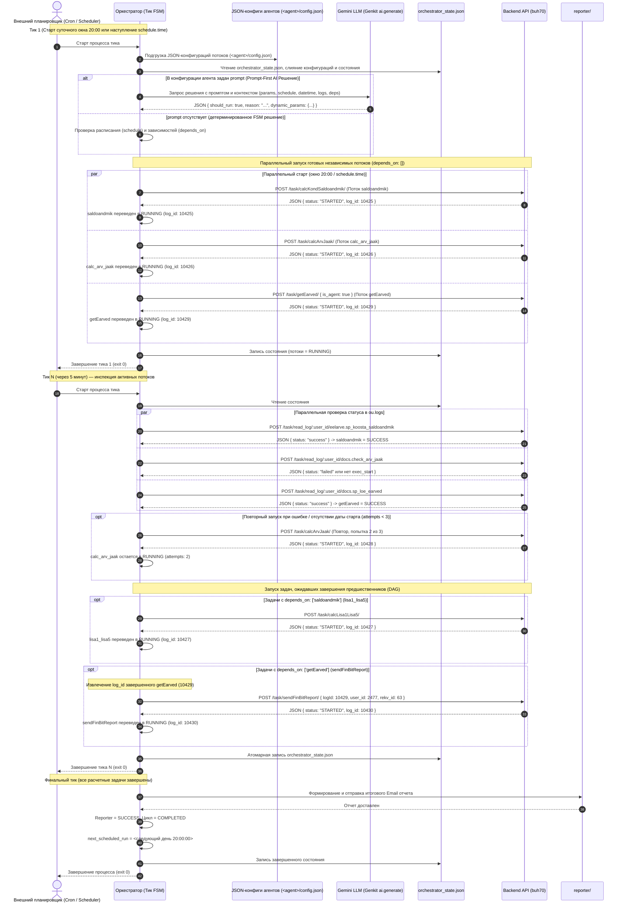

# Спецификация AI-Оркестратора Фоновых Задач (Genkit + TypeScript)

## 1. Обзор и архитектурные принципы

Проект разрабатывается как **полностью автономный микросервис** (Standalone Project), изолированный от монолита `buh70`.

- **Рабочий каталог проекта:** директория `ai_task/`. Все файлы конфигурации (`package.json`, `tsconfig.json`, `Dockerfile`, `.env`), исходный код и тесты располагаются непосредственно внутри этой папки.
- **Цель сервиса:** планирование, запуск и контроль регламентных расчетных процессов:
  1. Расчет сводного сальдоандмика (`saldoandmik`, flow: `eelarve.sp_koosta_saldoandmik`).
  2. Пересчет сальдо и остатков счетов (`calc_arv_jaak`, flow: `docs.check_arv_jaak` — **независимый параллельный поток**).
  3. Контрольные формы `lisa1_lisa5` (`lisa1_lisa5`, flow: `eelarve.salvesta_lisa_1_5_kontrol` — зависит от сальдоандмика).
  4. Импорт счетов из FinBit (`getEarved`, flow: `docs.sp_loe_earved` — **независимый параллельный поток**).
  5. Отправка отчета об импорте счетов FinBit (`sendFinBitReport`, flow: `sendFinBitReport` — **дочерний зависимый субагент для `getEarved`**: вызывается по итогу работы `getEarved`, получает от вышестоящего агента параметр `logId` записи импорта в `ou.logs` и инициирует отправку уведомлений получателям счетов через `POST /task/sendFinBitReport/`).
- **Технологическая основа:** **Google Genkit (TypeScript)** с возможностью развертывания в **Google Cloud Run** или запуска через системный планировщик задач (Cron / Task Scheduler).

### Ключевые архитектурные принципы:

1. **Zero Direct DB Access (Только API):**
   - Оркестратор и субагенты полностью изолированы от базы данных (PostgreSQL).
   - Любое взаимодействие (получение параметров, запуск расчетов, мониторинг логов) выполняется исключительно через **HTTP POST** вызовы API бэкенда `buh70`.
   - Вся работа с БД и хранимыми процедурами инкапсулирована внутри бэкенд-эндпоинтов, возвращающих результат в теле JSON-ответа.

2. **Stateless-оркестрация и память состояния (State Dump Memory):**
   - Оркестратор **не является постоянно работающим демоном** и не зависает в памяти в ожидании завершения многочасовых расчетов.
   - Сервис работает в режиме **кратковременного тика (Tick-based Execution)**: запускается внешней службой (Cron / Cloud Scheduler), выполняет атомарную итерацию (проверка статуса запущенных потоков -> запуск следующего готового потока при необходимости -> сохранение состояния) и **немедленно завершает работу**.
   - Текущий срез выполнения и история переходов сохраняются на диске в файле дампа состояния (`state/orchestrator_state.json`). При перезапусках сервера или контейнера контекст не теряется.

3. **Суточный регламент (Daily Run Window в 20:00) и гибкое расписание (Time & Date Scheduling):**
   - Регламентный расчетный цикл за текущие сутки открывается по умолчанию в **20:00 по местному времени** (`timezone: "Europe/Tallinn"`). Параметры времени старта и часового пояса вынесены в декларативный файл конфигурации самого оркестратора: `orchestrator/config.json` (`daily_start_time: "20:00"`).
   - **Индивидуальное расписание агентов (Time & Date Scheduler):** оркестратор поддерживает запуск отдельных агентов в определенное время (`time`, формат `HH:mm`) и (или) дату (день месяца `day`: 1-31, месяц `month`: 1-12).
   - Если такие параметры для агента заданы, агент запускается в момент, **когда данное время настало или сразу после** (на первом тике крона/планировщика после наступления времени).
   - По завершении всех потоков оркестратор переводит цикл в статус `COMPLETED`, фиксирует время завершения и устанавливает барьер следующего запуска: `next_scheduled_run = <следующий день> 20:00:00`.
   - Если планировщик (хрон) запускает оркестратор в течение суток до наступления времени следующего расчетного окна, процесс считывает дамп, убеждается, что текущий цикл завершен, и сразу завершает работу без лишних запросов к API.

4. **Асинхронный неблокирующий запуск тяжелых задач:**
   - Вызовы эндпоинтов запуска (`/task/calcKondSaldoandmik/`, `/task/calcArvJaak/`, `/task/calcLisa1Lisa5/`, `/task/getEarved/`, `/task/sendFinBitReport/`) являются неблокирующими: бэкенд создает запись в `ou.logs`, стартует фоновую процедуру и возвращает HTTP 200 со статусом `"STARTED"` и полученным `log_id`.
   - Мониторинг прогресса выполняется оркестратором на каждом тике крона через разовые неблокирующие запросы к `POST /task/read_log/:user_id/:task_name`.

5. **Граф зависимостей, передача параметров и параллельное исполнение потоков (DAG, Parent Context & Parallel Flows):**
   - Потоки организованы в виде направленного ациклического графа (Directed Acyclic Graph).
   - У каждого потока в конфигурации определяется массив зависимостей `depends_on: string[]`, признак `allow_parallel: boolean` и опциональное расписание `schedule`:
     - **Параллельный старт независимых потоков:** задачи с `depends_on: []` (например, `saldoandmik`, `calc_arv_jaak`, `getEarved`) запускаются **одновременно** при открытии расчетного окна или наступлении индивидуального времени расписания.
     - **Параллельный запуск зависимых потоков:** если несколько задач ожидают завершения одного и того же шага (например, `depends_on: ['saldoandmik']`), то при переходе этого шага в `SUCCESS` все зависимые задачи стартуют **параллельно** на одном тике.
     - **Передача параметров от вышестоящего агента (Parent Context Forwarding):** если дочерний субагент требует результат выполнения родительского шага (как субагент `sendFinBitReport`, которому необходим `logId` от вышестоящего агента `getEarved`), оркестратор при старте дочерней задачи автоматически извлекает фактический `log_id` родителя (`state.tasks['getEarved'].log_id`) и передает его в тело запроса запуска (`params.logId`).
     - **Каскадный пропуск:** если базовый поток завершился с ошибкой (`FAILED`), зависимые от него задачи автоматически помечаются как `SKIPPED`.

6. **Отсутствие таймаута на длительность работы агента (No Execution Timeout):**
   - Тяжелые расчетные финансовые и бухгалтерские процедуры в базе данных (сводный сальдоандмик, пересчет остатков, контрольные формы, импорт счетов, рассылка отчетов) выполняются на больших массивах данных и могут длиться произвольное время.
   - Оркестратор **не накладывает искусственных таймаутов** на время работы агента. Задача остается в статусе `RUNNING` до тех пор, пока бэкенд не зафиксирует результат в `ou.logs` или не произойдет сбой.

7. **Политика повторных запусков при сбое или отсутствии старта (Retry Policy, max 3 attempts):**
   - Если при проверке логов выполнения задачи:
     1) **Отсутствует дата и время старта агента** (`exec_start` в логах не заполнено / пусто / запись отсутствует);
     2) **Статус задачи равен ошибке** (`status = 'failed'` или `'error'`),
   - Оркестратор осуществляет **повторный запуск агента** с ограничением количества попыток: **не более 3 попыток** (`max_attempts = 3`).
   - Если лимит попыток исчерпан (3 неудачные попытки), задача окончательно переводится в статус `FAILED`, фиксируется ошибка, а зависимые задачи пропускаются (`SKIPPED`).

8. **Sub-agent Folder Isolation (Каждый субагент в своем каталоге):**
   - Каждый субагент располагается в отдельном подкаталоге (`saldoandmik/`, `calc_arv_jaak/`, `lisa1_lisa5/`, `getEarved/`, `sendFinBitReport/`, `logs_watcher/`, `reporter/`).
   - Логика, инструменты (tools), Zod-схемы валидации и тесты изолированы внутри каталога соответствующего модуля.

9. **Децентрализованная конфигурация в формате JSON (`orchestrator/config.json` и `<agent>/config.json`) и двухуровневый движок решений (Two-Tier Prompt-driven AI + FSM):**
   - **Единый стандарт JSON-конфигураций:** не только подчиненные субагенты, но и **сам главный оркестратор** имеет собственный файл конфигурации в формате JSON (`orchestrator/config.json`), расположенный в модуле `orchestrator/`.
   - **Конфигурация оркестратора (`orchestrator/config.json`):**
     1) Базовое суточное время старта по местному времени (`daily_start_time: "20:00"`);
     2) Часовой пояс для корректного расчета времени (`timezone: "Europe/Tallinn"`);
     3) Максимальное количество попыток перезапуска задач при сбоях (`max_task_attempts: 3`);
     4) Общие параметры по умолчанию (`params: { userId, rekvId, kond }`);
     5) **Мета-промпт управления циклом (`prompt`: `string | null`):** директива верхнего уровня для AI-управления всем суточным циклом.
   - **Конфигурация субагентов (`<agent>/config.json`):** у каждого субагента определен свой файл (`saldoandmik/config.json`, `calc_arv_jaak/config.json`, `getEarved/config.json`, `sendFinBitReport/config.json`, `lisa1_lisa5/config.json`, `reporter/config.json`), определяющий `flow`, `schedule`, `allow_parallel`, `depends_on`, `max_attempts`, `params` и локальный `prompt`.
   - **Двухуровневый движок AI-принятия решений (Two-Tier Decision Engine):**
     1. **Уровень 1: Мета-решение по суточному циклу (Cycle Decision):**
        - Если в `orchestrator/config.json` задан `prompt`, оркестратор перед расчетом задач передает глобальный контекст тика в Gemini LLM.
        - Модель выносит вердикт по циклу: `action: 'RUN_CYCLE' | 'WAIT_SCHEDULE' | 'SKIP_CYCLE' | 'PAUSE_CYCLE'`, `force_run: boolean` и `reason`.
        - *Пример:* промпт может содержать инструкцию: *"Если в apiBaseUrl обнаружен localhost или 127.0.0.1, открывай суточный цикл немедленно (force_run=true), игнорируя ожидание 20:00"*.
        - Если `prompt` в `orchestrator/config.json` отсутствует (`null`), оркестратор следует детерминированным правилам времени (проверка `current_time >= daily_start_time`).
     2. **Уровень 2: Решение по запуску конкретной задачи (Task Launch Decision):**
        - Внутри открытого цикла каждая задача с заданным `prompt` в своем `<agent>/config.json` оценивается через LLM (с передачей параметров задачи, истории `ou.logs` и адреса API в контекст).
        - Задачи без промпта запускаются детерминированно по FSM-правилам готовности зависимостей и индивидуального расписания.
   - **Динамическая подгрузка оркестратором:** при запуске каждого тика планировщика оркестратор динамически считывает `orchestrator/config.json` и конфигурации всех потоков, строит актуальный направленный граф (DAG) и принимает решение без необходимости пересборки (`npm run build`) или перезапуска демона.
   - **Разделение статической конфигурации и динамического состояния:**
     - `orchestrator/config.json` и `<agent>/config.json` — декларативная статическая конфигурация.
     - `state/orchestrator_state.json` — динамическое состояние выполнения за текущие сутки.

10. **Контроль результатов выполнения задач (ou.logs result inspection), AI-семантическая верификация и информативная отчетность:**
    - **Чтение полной структуры логов из `ou.logs`:** Эндпоинт `POST /task/read_log/:user_id/:task_name` возвращает не только статус выполнения верхнего уровня (`flow`, `status`, `exec_start`, `exec_end`), но и фактическое тело результата из СУБД: `result` (структурированный JSONB/массив объектов), `response` (строковый ответ) и `error` (сообщение об ошибке).
    - **Выявление скрытых ошибок (Deep Inspection):** В СУБД или Node.js процедура может вернуть формальный `status: "success"`, если выполнение не привело к необработанному исключению (crash). Однако внутри массива `result` отдельные операции могут завершиться аварийно (например, `success: false`, таймауты почтовых серверов `connect ETIMEDOUT` при рассылке счетов). Оркестратор и `logs_watcher` проводят глубокий парсинг содержимого `result`, выявляя сбои.
    - **AI-контроль результатов (если в конфигурации задан `prompt`):** Если у субагента в `<agent>/config.json` задан `prompt`, оркестратор формирует контекст с полученным результатом (`logResult`, `logResponse`, `logError`, `status`, выявленные ошибки) и передает его в Gemini LLM. Модель руководствуется инструкцией промпта, оценивает критичность возникших сбоев и возвращает структурированный вердикт (`is_success: boolean`, `status: 'SUCCESS' | 'FAILED'`, `summary: string`, `error: string | null`).
    - **Детерминированный fallback (при отсутствии `prompt`):** Если промпт не задан, действует строгое правило FSM: при наличии ошибок в `result` (например, все письма завершились с ошибкой) задача переводится в `FAILED` с сохранением текста ошибки для повторного запуска (`retry`) или фиксации сбоя.
    - **Информативная отчетность в агенте `reporter`:** Точный текст ошибок (например, `vladislav.gordin@gmail.com: connect ETIMEDOUT 213.184.47.202:25`) и краткая сводка (`resultSummary`) передаются в агент `reporter`, выводятся в итоговом Markdown и HTML отчете с цветовой подсветкой, и определяют итоговый статус расчетного цикла (`overallSuccess`).

---

## 2. Диаграмма взаимодействия (Sequence Diagram)



---

## 3. Алгоритм работы оркестратора (Конечный автомат по Cron)

Оркестратор функционирует по модели конечного автомата (Finite State Machine). При каждом запуске процессом планировщика (Cron) выполняется следующий алгоритм:

1. **Подгрузка конфигураций субагентов (JSON configs) и слияние с памятью состояния (Task Graph Reconciliation):**
   - При каждом запуске тика оркестратор сканирует изолированные подкаталоги субагентов (`saldoandmik/`, `calc_arv_jaak/`, `getEarved/`, `sendFinBitReport/`, `lisa1_lisa5/`, `reporter/`) и динамически считывает файл `config.json` каждого агента.
   - Из каждого `config.json` извлекаются: имя потока (`flow`), расписание (`schedule`: `time`, `day`, `month`), режим запуска (`allow_parallel: true/false`), зависимости (`depends_on: string[]`), лимит попыток (`max_attempts`) и параметры по умолчанию.
   - Загружается файл оперативного состояния `state/orchestrator_state.json` (при его отсутствии создается начальное состояние на основе считанных JSON-конфигураций).
   - **Слияние конфигураций с оперативным состоянием:** декларативные параметры графа (время старта, зависимости, параллельность, лимит попыток) обновляются из актуальных `config.json`, сохраняя при этом текущий оперативный статус суточного выполнения задач (`RUNNING`, `SUCCESS`, `attempts`, `log_id`, время старта и окончания).
   - Если в каталог добавлен новый субагент с файлом `config.json`, оркестратор автоматически включает его в граф задач со статусом `PENDING`.
   - На основе полученного графа оркестратор принимает решения об исполнении: оценивает наступление времени старта и готовность зависимых потоков.

2. **Проверка смены календарного дня (Calendar Day Rollover):**
   - Сравнивается текущая локальная дата сервера (`currentDate`, формат `YYYY-MM-DD`) с датой цикла в файле (`state.cycle_date`):
   - **Если текущая дата больше даты цикла (`currentDate > state.cycle_date`):**
     - Предыдущий суточный цикл признается завершенным в прошлом.
     - Инициируется **новый суточный расчетный цикл** на сегодняшнюю дату (`targetDateStr`).
     - Все задачи переводятся в статус `PENDING`, счетчики попыток сбрасываются в `0`, а устаревшее поле `next_scheduled_run` сбрасывается, исключая блокировку задач нового дня.

3. **Сверка с фактическими логами СУБД перед принятием решений (`ou.logs` Reconciliation Phase):**
   Прежде чем сделать вывод об отсутствии работы или уйти в режим ожидания (`IDLE_WAIT_NEXT_SCHEDULE` / `IDLE_WAIT_START_HOUR`), оркестратор опрашивает реальный журнал `ou.logs` через `POST /task/read_log/:user_id/:task_name` за текущую дату (`targetDateStr`):
   - **Для задач с расписанием (в частности `getEarved` на 12:30):**
     - Проверяются записи в логах `docs.sp_loe_earved` за сегодняшний день, запущенные **в заданное время или позже (`exec_start >= schedule.time`, т.е. >= 12:30 местного времени)**.
     - **Если запуск `>= 12:30` найден со статусом `success`:** в `state.tasks.getEarved` фиксируется статус `SUCCESS`, сохраняются `log_id`, длительность и время завершения.
     - **Если запуск в логах был только ДО 12:30 (например, ручной запуск в 08:00 утра) или отсутствует вовсе:** утренний запуск **не засчитывается** в качестве выполнения регламентной задачи за 12:30. Если текущее время сервера `>= 12:30`, задача признается **не выполненной** за текущие сутки и переходит к запуску на текущем тике.
     - **Если запуск `>= 12:30` находится в процессе исполнения (`in_progress`):** статус задачи синхронизируется на `RUNNING`.
   - **Для вечерних задач (без индивидуального расписания):**
     - Проверяются логи за сегодняшнюю дату. Если расчет (например, `saldoandmik`) уже был успешно выполнен внешним триггером, статус в `state` синхронизируется на `SUCCESS`.
   - **Правило перехода в спячку (`IDLE_WAIT_NEXT_SCHEDULE`):**
     - Оркестратор имеет право не выполнять действия и ожидать наступления `next_scheduled_run` **ТОЛЬКО** в том случае, если ВСЕ задачи, чье время расписания наступило (включая дневной `getEarved` после 12:30), уже имеют подтвержденный статус `SUCCESS` (или `SKIPPED`) в БД и в `state`.

4. **Инспекция выполняющихся потоков (`RUNNING`):**
   - Находятся **все** потоки, находящиеся в текущий момент в статусе `RUNNING`.
   - Для каждого активного потока параллельно (`Promise.allSettled`) выполняется **однократный** неблокирующий запрос статуса `POST /task/read_log/:user_id/:task_name`.
   - **Анализ ответа из логов и переходы состояний:**
     - **А. Успешное завершение (`status = 'success'`):**
       - Статус потока меняется на `SUCCESS`.
       - Фиксируются `finished_at` и фактическая длительность (`duration_ms`).
     - **Б. Сбой или отсутствие фиксации старта агента:**
       - Критерии обнаружения:
         1) В полученном логе **отсутствуют дата и время старта** (`exec_start` равен `null`, пустой или запись лога отсутствует вовсе);
         2) Статус выполнения в логах равен ошибке: `status = 'failed'` или `status = 'error'`.
       - Проверяется счетчик выполненных попыток `attempts` (при первом старте `attempts = 1`, лимит `max_attempts = 3`):
         - **Если `attempts < 3`:**
           - Увеличивается счетчик: `attempts = attempts + 1`.
           - Выполняется **повторный запуск субагента** через вызов соответствующего эндпоинта (получается новый `log_id`, обновляется `started_at`).
           - В `history` фиксируется событие `TASK_RETRY` с указанием номера попытки (`attempt: 2` или `3`) и причины перезапуска.
           - Поток остается в статусе `RUNNING` под управлением новой попытки.
         - **Если лимит попыток исчерпан (`attempts >= 3`):**
           - Поток окончательно переводится в статус `FAILED`.
           - В поле `error` фиксируется детальная информация: `Задача завершилась ошибкой или не стартовала после 3 попыток`.
           - Все зависимые потоки графа (`depends_on`) автоматически помечаются как `SKIPPED`.
     - **В. Задача в процессе штатного исполнения:**
       - В логах присутствует корректная дата старта (`exec_start`), статус еще не завершен (не `success` и не `failed`).
       - Поток остается в статусе `RUNNING`.
       - **Таймаут отсутствует:** искусственное ограничение на максимальное время работы агента снято. Расчет выполняется столько времени, сколько необходимо СУБД для полного завершения.

5. **Оценка графа зависимостей, расписания и запуск готовых потоков (`PENDING`):**
   - Проверяются все задачи в статусе `PENDING`.
   - Для каждой задачи оркестратор выбирает одну из двух ветвей принятия решения о готовности к запуску:

     #### Ветвь А: Интеллектуальное решение через LLM (Prompt-First, если задан `config.prompt`)
     Если в `config.json` агента задан непустой `prompt`, оркестратор **руководствуется им в первую очередь**:
     1. **Формирование контекста:** Оркестратор собирает полный структурированный срез текущей обстановки:
        - Параметры задачи по умолчанию (`params`: `userId`, `rekvId`, др.);
        - Настройки расписания (`schedule`: `time`, `day`, `month`);
        - Текущее локальное время и дату сервера (ISO и HH:mm);
        - Фактические статусы предшествующих потоков (`dependencies_state`: `saldoandmik = SUCCESS` и т.д.);
        - Число выполненных попыток и историю сбоев (`attempts`, `last_error`);
        - Недавние записи в `ou.logs` по связанным потокам (при наличии).
     2. **Вызов языковой модели:** Оркестратор обращается к Gemini через Genkit (`ai.generate`) с системной директивой из `config.prompt` и собранным JSON-контекстом.
     3. **Структурированный вердикт (`DecisionOutputSchema`):**
        ```typescript
        interface AgentLaunchDecision {
          should_run: boolean;                         // Решение: запускать ли поток на текущем тике
          reason: string;                             // Обоснование решения моделью
          action?: 'RUN' | 'WAIT' | 'SKIP';           // Предписанное действие
          dynamic_params?: Record<string, unknown>;   // Динамически скорректированные параметры вызова
        }
        ```
     4. **Применение вердикта:**
        - Если `should_run === true` (или `action === 'RUN'`): задача добавляется в пул готовых к старту (с подстановкой `dynamic_params` при их наличии).
        - Если `action === 'WAIT'`: задача остается в `PENDING` и ожидает следующего тика (причина фиксируется в логе тика).
        - Если `action === 'SKIP'`: задача переводится в `SKIPPED`, фиксируется `reason`, инициируется каскадный пропуск зависимых задач.

     #### Ветвь Б: Детерминированное FSM-решение (если `prompt` не задан или равен `null`)
     Оркестратор работает по жестким правилам без вызова нейросети и без расхода токенов:
     - **Проверка зависимостей (`depends_on`):** Все потоки из `depends_on` должны иметь статус `SUCCESS`. При наличии `FAILED`/`SKIPPED` предшественника задача каскадно помечается как `SKIPPED`.
     - **Проверка индивидуального расписания (`schedule`):**
       1) **Месяц (`schedule.month`, 1-12):** совпадение с текущим месяцем (иначе `SKIPPED`).
       2) **День месяца (`schedule.day`, 1-31):** совпадение с текущим днем (иначе `SKIPPED`).
       3) **Время суток (`schedule.time`, HH:mm):** текущее время `>= schedule.time`. До наступления времени задача ожидает в `PENDING`.
       4) Если `schedule == null`: запуск в рамках базового вечернего окна (`dailyStartHour = 20:00`).

   - **Запуск готовых задач и передача параметров от вышестоящих агентов (Parent Context Forwarding):**
     - Если запускаемая задача зависит от предшественника и требует его выходных данных (например, субагент `sendFinBitReport`, зависящий от `getEarved`, требует `logId` записи импорта), оркестратор автоматически подставляет `log_id` родительской задачи (`state.tasks['getEarved'].log_id`) в параметры вызова (`params.logId`).
     - Все задачи, признанные готовыми к запуску (по ветви А или Б) и имеющие `allow_parallel: true`, стартуют одновременно (`Promise.allSettled`) через неблокирующие API-эндпоинты, получают `log_id` и переводятся в статус `RUNNING`. Потоки с `allow_parallel: false` запускаются строго монопольно.

6. **Сохранение дампа состояния и завершение тика:**
   - Измененное состояние атомарно записывается в файл `state/orchestrator_state.json`.
   - Процесс оркестратора немедленно завершает выполнение с кодом `0`.

---

## 3.1. Спецификация файла состояния (`orchestrator_state.json`)

Файл состояния располагается по пути `ai_task/state/orchestrator_state.json` и имеет строго валидируемую JSON-структуру:

```json
{
  "version": 1,
  "cycle_date": "2026-09-15",
  "status": "IN_PROGRESS",
  "last_tick_at": "2026-09-15T20:05:00.000Z",
  "next_scheduled_run": "2026-09-16T20:00:00.000Z",
  "params": {
    "user_id": 2477,
    "rekv_id": 63,
    "kond": 1
  },
  "tasks": {
    "saldoandmik": {
      "flow": "eelarve.sp_koosta_saldoandmik",
      "depends_on": [],
      "allow_parallel": true,
      "schedule": null,
      "status": "RUNNING",
      "attempts": 1,
      "max_attempts": 3,
      "log_id": 10425,
      "started_at": "2026-09-15T20:00:05.000Z",
      "finished_at": null,
      "duration_ms": null,
      "error": null
    },
    "calc_arv_jaak": {
      "flow": "docs.check_arv_jaak",
      "depends_on": [],
      "allow_parallel": true,
      "schedule": null,
      "status": "RUNNING",
      "attempts": 2,
      "max_attempts": 3,
      "log_id": 10428,
      "started_at": "2026-09-15T20:05:00.000Z",
      "finished_at": null,
      "duration_ms": null,
      "error": null
    },
    "getEarved": {
      "flow": "docs.sp_loe_earved",
      "depends_on": [],
      "allow_parallel": true,
      "schedule": {
        "time": "12:30",
        "day": null,
        "month": null
      },
      "status": "RUNNING",
      "attempts": 1,
      "max_attempts": 3,
      "log_id": 10429,
      "started_at": "2026-09-15T20:00:05.000Z",
      "finished_at": null,
      "duration_ms": null,
      "error": null
    },
    "sendFinBitReport": {
      "flow": "sendFinBitReport",
      "depends_on": ["getEarved"],
      "allow_parallel": true,
      "schedule": null,
      "status": "PENDING",
      "attempts": 0,
      "max_attempts": 3,
      "log_id": null,
      "started_at": null,
      "finished_at": null,
      "duration_ms": null,
      "error": null
    },
    "lisa1_lisa5": {
      "flow": "eelarve.salvesta_lisa_1_5_kontrol",
      "depends_on": ["saldoandmik"],
      "allow_parallel": true,
      "schedule": null,
      "status": "PENDING",
      "attempts": 0,
      "max_attempts": 3,
      "log_id": null,
      "started_at": null,
      "finished_at": null,
      "duration_ms": null,
      "error": null
    },
    "reporter": {
      "flow": "email_report",
      "depends_on": ["saldoandmik", "calc_arv_jaak", "getEarved", "sendFinBitReport", "lisa1_lisa5"],
      "allow_parallel": false,
      "schedule": null,
      "status": "PENDING",
      "attempts": 0,
      "max_attempts": 3,
      "log_id": null,
      "started_at": null,
      "finished_at": null,
      "duration_ms": null,
      "error": null
    }
  },
  "history": [
    {
      "timestamp": "2026-09-15T20:00:05.000Z",
      "event": "TASKS_PARALLEL_STARTED",
      "tasks": ["saldoandmik", "calc_arv_jaak", "getEarved"]
    },
    {
      "timestamp": "2026-09-15T20:05:00.000Z",
      "event": "TASK_RETRY",
      "task": "calc_arv_jaak",
      "attempt": 2,
      "reason": "MISSING_START_DATE_OR_FAILED"
    }
  ]
}
```

### Допустимые статусы:

#### Статусы суточного цикла (`status`):
- `IDLE` — ожидание наступления расчетного окна или запланированного времени.
- `IN_PROGRESS` — расчетный цикл находится в процессе выполнения.
- `COMPLETED` — все потоки дня успешно обработаны, отчет отправлен, запуск заблокирован до 20:00 следующего дня.
- `FAILED` — цикл завершился критической ошибкой цепочки (после исчерпания допустимых попыток).

#### Статусы задач (`tasks.*.status`):
- `PENDING` — ожидает наступления запланированного времени/даты или завершения предшественников.
- `RUNNING` — запущен в фоновом режиме бэкенда (`log_id` получен), ожидается завершение (время работы не ограничено таймаутом).
- `SUCCESS` — успешно завершен бэкендом (`ou.logs.status = 'success'`).
- `FAILED` — завершен с ошибкой или не смог стартовать после исчерпания всех 3 попыток перезапуска.
- `SKIPPED` — пропущен вследствие ошибки предшественника или несовпадения даты расписания (день/месяц) с текущим циклом.

#### Параметры индивидуального расписания задачи (`tasks.*.schedule`):
- `time` (`string | null`) — время запуска в формате `HH:mm` (например, `"20:00"`, `"06:30"`). Задача стартует в момент, когда данное время настало или сразу после (на первом тике крона).
- `day` (`number | null`) — день месяца (1-31). Если указан, запуск выполняется в указанный день месяца.
- `month` (`number | null`) — месяц года (1-12). Если указан, запуск выполняется в указанный месяц года.
- `null` (по умолчанию) — задача не ограничена отдельным расписанием и стартует при открытии расчетного окна суток (20:00) при готовности предшественников.

---

## 3.2. Спецификация JSON-конфигураций (`orchestrator/config.json` и `<agent>/config.json`)

Оркестратор и все подчиненные субагенты имеют собственные изолированные файлы конфигурации в формате JSON (`orchestrator/config.json` и `<agent>/config.json`). Это позволяет независимо настраивать время старта, часовой пояс, параллельный или последовательный режим, зависимости, параметры и AI-промпты **без необходимости изменения TypeScript-кода и без выполнения повторной сборки (`npm run build`)**.

### 3.2.1. Спецификация конфигурации самого оркестратора (`orchestrator/config.json`)

Файл `orchestrator/config.json` определяет глобальные параметры суточного расчетного цикла:
- `name` (`string`) — уникальное имя ("orchestrator").
- `daily_start_time` (`string`) — время старта суточного окна по местному времени в формате `HH:mm` (по умолчанию: `"20:00"`).
- `timezone` (`string`) — часовой пояс для расчета наступления времени (по умолчанию: `"Europe/Tallinn"`).
- `max_task_attempts` (`number`) — максимальное количество попыток перезапуска задач при сбоях (по умолчанию: `3`).
- `params` (`object`) — параметры по умолчанию для вызовов процедур (`userId`, `rekvId`, `kond`).
- `prompt` (`string | null`) — мета-промпт для языковой модели Gemini. При наличии промпта оркестратор запрашивает решение верхнего уровня (`CycleDecision`), что позволяет динамически открывать окно расчетов (например, в тестовом режиме на `localhost`).

#### Контракт ответа Meta-Orchestrator модели (`CycleDecisionSchema`):
```json
{
  "$schema": "http://json-schema.org/draft-07/schema#",
  "title": "CycleDecision",
  "type": "object",
  "required": ["action", "force_run", "reason"],
  "properties": {
    "action": {
      "type": "string",
      "enum": ["RUN_CYCLE", "WAIT_SCHEDULE", "SKIP_CYCLE", "PAUSE_CYCLE"],
      "default": "RUN_CYCLE",
      "description": "Предписанное действие по суточному циклу"
    },
    "force_run": {
      "type": "boolean",
      "default": false,
      "description": "Принудительный запуск цикла до наступления daily_start_time (например, на localhost)"
    },
    "reason": {
      "type": "string",
      "description": "Обоснование принятого решения моделью"
    },
    "cycle_params_override": {
      "type": "object",
      "description": "Скорректированные параметры цикла"
    }
  }
}
```

### 3.2.2. Схема полей конфигурации субагента (`AgentConfig`):

```json
{
  "$schema": "http://json-schema.org/draft-07/schema#",
  "title": "AgentConfig",
  "type": "object",
  "required": ["name", "flow", "allow_parallel", "depends_on"],
  "properties": {
    "name": {
      "type": "string",
      "description": "Уникальный идентификатор субагента (ключ в графе)"
    },
    "flow": {
      "type": "string",
      "description": "Имя процедуры / потока, регистрируемое в ou.logs"
    },
    "description": {
      "type": "string",
      "description": "Человекочитаемое описание назначения агента"
    },
    "allow_parallel": {
      "type": "boolean",
      "default": true,
      "description": "Признак параллельного (true) или строго последовательного (false) запуска"
    },
    "depends_on": {
      "type": "array",
      "items": { "type": "string" },
      "default": [],
      "description": "Список имен агентов/потоков, успешного завершения (SUCCESS) которых ожидает данный агент"
    },
    "schedule": {
      "type": ["object", "null"],
      "default": null,
      "description": "Индивидуальное расписание запуска. Если null - запускается в базовое вечернее окно (20:00)",
      "properties": {
        "time": {
          "type": "string",
          "pattern": "^([01]\\d|2[0-3]):([0-5]\\d)$",
          "description": "Время старта в формате HH:mm (например, 12:30 или 20:00)"
        },
        "day": {
          "type": ["number", "null"],
          "minimum": 1,
          "maximum": 31,
          "description": "День месяца (1-31) для ежемесячного запуска"
        },
        "month": {
          "type": ["number", "null"],
          "minimum": 1,
          "maximum": 12,
          "description": "Месяц года (1-12) для ежегодного запуска"
        }
      }
    },
    "prompt": {
      "type": ["string", "null"],
      "default": null,
      "description": "Инструкция для языковой модели (LLM / Gemini). Если задана, оркестратор руководствуется этим промптом в первую очередь, а параметры задачи (params, schedule, datetime, logs, deps) передает как контекст для принятия решения о запуске потока"
    },
    "max_attempts": {
      "type": "number",
      "default": 3,
      "minimum": 1,
      "description": "Максимальное количество попыток запуска при ошибке или отсутствии даты старта в логах"
    },
    "params": {
      "type": "object",
      "description": "Параметры по умолчанию, передаваемые в API запроса бэкенда"
    }
  }
}
```

### 3.2.3. Контракт структурированного ответа модели по задаче (`DecisionOutputSchema`):

Когда у агента задан `prompt`, языковая модель Gemini через Genkit Structured Output возвращает строго валидируемый JSON-объект решения:

```json
{
  "$schema": "http://json-schema.org/draft-07/schema#",
  "title": "AgentLaunchDecision",
  "type": "object",
  "required": ["should_run", "reason"],
  "properties": {
    "should_run": {
      "type": "boolean",
      "description": "Итоговый вердикт LLM: запускать ли поток на текущем тике"
    },
    "reason": {
      "type": "string",
      "description": "Подробное обоснование решения моделью на основе промпта и контекста"
    },
    "action": {
      "type": "string",
      "enum": ["RUN", "WAIT", "SKIP"],
      "default": "RUN",
      "description": "Предписанное действие: RUN - немедленный старт, WAIT - ожидать следующего тика, SKIP - пропустить в текущем цикле"
    },
    "dynamic_params": {
      "type": "object",
      "description": "Опциональные параметры, вычисленные моделью (например, скорректированная дата выборки счетов date_query_from)"
    }
  }
}
```

### 3.2.4. Эталонные конфигурационные файлы

#### 0. Главный Оркестратор (`orchestrator/config.json`)
Глобальная конфигурация суточного расчетного цикла с временем старта по местному времени и мета-промптом:
```json
{
  "name": "orchestrator",
  "description": "Главный координатор регламентных расчетных процессов buh70",
  "daily_start_time": "20:00",
  "timezone": "Europe/Tallinn",
  "max_task_attempts": 3,
  "params": {
    "userId": 2477,
    "rekvId": 63,
    "kond": 1
  },
  "prompt": "Ты — AI-руководитель регламентного расчетного сервиса buh70. Твоя задача — оценить контекст выполнения тика и принять решение об открытии или пропуске суточного расчетного цикла. Руководствуйся правилами: 1) Режим тестирования: если в apiBaseUrl фигурирует 'localhost' или '127.0.0.1', разрешай запуск цикла немедленно (action='RUN_CYCLE', force_run=true), не ожидая наступления 20:00. 2) В рабочем режиме (production) цикл должен запускаться строго не ранее daily_start_time по местному времени (action='RUN_CYCLE' если время настало, иначе action='WAIT_SCHEDULE'). 3) В поле reason четко укажи проверку режима, текущее время и обоснование решения."
}
```

#### 1. Сальдоандмик (`saldoandmik/config.json`)
Независимый параллельный поток базового вечернего окна:
```json
{
  "name": "saldoandmik",
  "flow": "eelarve.sp_koosta_saldoandmik",
  "description": "Расчет сводного сальдоандмика",
  "allow_parallel": true,
  "depends_on": [],
  "schedule": null,
  "max_attempts": 3,
  "params": {
    "userId": 2477,
    "rekvId": 63,
    "kond": 1
  }
}
```

#### 2. Остатки счетов (`calc_arv_jaak/config.json`)
Независимый параллельный поток пересчета остатков счетов с интеллектуальным промптом для тестового режима (localhost):
```json
{
  "name": "calc_arv_jaak",
  "flow": "docs.check_arv_jaak",
  "description": "Пересчет сальдо и остатков счетов",
  "allow_parallel": true,
  "depends_on": [],
  "schedule": null,
  "prompt": "Ты — AI-контролер регламентного процесса пересчета остатков счетов calc_arv_jaak системы buh70. Твоя задача — проанализировать контекст вызова и принять решение о запуске потока. Руководствуйся следующими правилами: 1) Определи режим тестирования по адресу API вызова (поле apiBaseUrl в контексте): если в адресе фигурирует 'localhost' или '127.0.0.1', считаем, что это режим теста. 2) На период тестирования (когда определен режим теста) запускать агента каждый раз, когда статус выполнения равен 'SUCCESS' (taskStatus = 'SUCCESS' или status = 'success'), возвращая should_run=true и action='RUN'. 3) Если режим теста не подтвержден (в apiBaseUrl нет localhost), следовать стандартным регламентным правилам и не перезапускать успешно выполненную задачу. 4) В поле reason четко укажи, обнаружен ли localhost в apiBaseUrl, текущий статус задачи и принятое решение.",
  "max_attempts": 3,
  "params": {
    "userId": 2477,
    "rekvId": 63
  }
}
```

#### 3. Импорт счетов FinBit (`getEarved/config.json`)
Независимый параллельный поток с индивидуальным дневным расписанием и интеллектуальным промптом для LLM:
```json
{
  "name": "getEarved",
  "flow": "docs.sp_loe_earved",
  "description": "Импорт электронных счетов из FinBit в агентском режиме",
  "allow_parallel": true,
  "depends_on": [],
  "schedule": {
    "time": "12:30",
    "day": null,
    "month": null
  },
  "max_attempts": 3,
  "params": {
    "userId": 2477,
    "rekvId": 63,
    "is_agent": true
  },
  "prompt": "Ты — финансовый AI-контролер системы buh70. Твоя задача — принять решение о запуске импорта электронных счетов FinBit (docs.sp_loe_earved). Руководствуйся следующими правилами в первую очередь: 1) Запуск разрешен только если текущее время сервера >= 12:30. 2) Проверь переданные недавние логи recent_logs: если менее 20 минут назад произошел сбой соединения со шлюзом FinBit, верни action='WAIT' и should_run=false. 3) Если сегодня понедельник, передай в dynamic_params дату выборки date_query_from за прошлую пятницу. 4) Если все условия выполнены штатно, верни should_run=true, action='RUN' и укажи причину запуска."
}
```

#### 4. Отправка отчетов FinBit по импортированным счетам (`sendFinBitReport/config.json`)
Зависимый поток, вызываемый строго после завершения `getEarved` и получающий `logId` от родительского агента:
```json
{
  "name": "sendFinBitReport",
  "flow": "sendFinBitReport",
  "description": "Формирование и отправка email-уведомлений получателям импортированных счетов FinBit с передачей logId",
  "allow_parallel": true,
  "depends_on": [
    "getEarved"
  ],
  "schedule": null,
  "prompt": "Ты — AI-контролер регламентного процесса отправки отчетов по счетам sendFinBitReport системы buh70. Твоя задача — проанализировать результаты отправки email из логов. Если в массиве result есть ошибки (success: false, connect ETIMEDOUT, SMTP ошибки) или поле error не пустое, зафиксировать статус выполнения как FAILED, извлечь конкретные адреса получателей и текст ошибок, и сформировать информативное резюме для итогового отчета reporter. Если все письма успешно отправлены (success: true), подтвердить статус SUCCESS.",
  "max_attempts": 3,
  "params": {
    "userId": 2477,
    "rekvId": 63
  }
}
```
> [!NOTE]
> Параметр `logId` не хардкодится в статическом `config.json`, а динамически инжектируется оркестратором из дампа состояния (`state.tasks['getEarved'].log_id`) по механизму *Parent Context Forwarding* при подготовке запуска задачи.

#### 5. Контроль Lisa 1 / Lisa 5 (`lisa1_lisa5/config.json`)
Зависимый поток, ожидающий успешного завершения расчета `saldoandmik`:
```json
{
  "name": "lisa1_lisa5",
  "flow": "eelarve.salvesta_lisa_1_5_kontrol",
  "description": "Контрольные формы Lisa 1 и Lisa 5",
  "allow_parallel": true,
  "depends_on": [
    "saldoandmik"
  ],
  "schedule": null,
  "prompt": null,
  "max_attempts": 3,
  "params": {
    "userId": 2477,
    "rekvId": 63
  }
}
```

#### 6. Итоговый отчет (`reporter/config.json`)
Строго последовательный финальный поток (`allow_parallel: false`), ожидающий завершения всех расчетных процедур графа:
```json
{
  "name": "reporter",
  "flow": "email_report",
  "description": "Формирование и отправка сводного email-отчета по результатам цикла",
  "allow_parallel": false,
  "depends_on": [
    "saldoandmik",
    "calc_arv_jaak",
    "getEarved",
    "sendFinBitReport",
    "lisa1_lisa5"
  ],
  "schedule": null,
  "prompt": null,
  "max_attempts": 3,
  "params": {}
}
```

### 3.2.5. Порядок подгрузки конфигураций и двухуровневое принятие решений оркестратором

1. **Загрузка конфигурации оркестратора:** На старте тика оркестратор загружает `orchestrator/config.json`, определяя базовое время старта (`daily_start_time`), часовой пояс (`timezone`), лимиты попыток и мета-промпт.
2. **Оценка решения верхнего уровня (Meta-Cycle Decision):**
   - Если в `orchestrator/config.json` задан `prompt`, оркестратор формирует контекст тика и вызывает Gemini.
   - Модель возвращает `CycleDecision` (`RUN_CYCLE`, `WAIT_SCHEDULE`, `SKIP_CYCLE`, `PAUSE_CYCLE`, `force_run`).
   - Если промпт отсутствует, оркестратор проверяет `isDailyExecutionWindowOpen(currentDate, daily_start_time, timezone)` программно.
3. **Сканирование субагентов и построение DAG:** Оркестратор загружает все `<agent>/config.json`, валидирует схемы через `AgentConfigSchema` и строит направленный ациклический граф (DAG).
4. **Сверка с рантайм-состоянием:** Объединение статических полей из конфигураций с динамическими статусами (`PENDING`, `RUNNING`, `SUCCESS`, `FAILED`) из `state/orchestrator_state.json`.
5. **Оценка запуска конкретных задач (Task Launch Decision):**
   - Для задач с `prompt` вызывается Gemini через `ai.generate` (Prompt-First AI).
   - Для задач без `prompt` проверяется готовность зависимостей и расписание (Детерминированный FSM).
6. **Параллельный запуск:** Все задачи, признанные готовыми к старту и имеющие `allow_parallel: true`, запускаются одновременно (`Promise.allSettled`). Задачи с `allow_parallel: false` (например, `reporter`) запускаются последовательно после завершения всех вычислений.

---

## 4. Каталог субагентов и эндпоинтов (Folders & Endpoints)

| Субагент / Модуль | Подкаталог | Основной эндпоинт / Протокол | Flow в `ou.logs` | Режим работы | Зона ответственности |
|---|---|---|---|---|---|
| **Главный Оркестратор** | `orchestrator/` | Вызов тика по расписанию (CLI / Flow) | — | **Stateless (Тик / DAG)** | Чтение/запись дампа, оценка расписания и графа зависимостей, параллельный запуск потоков |
| **Менеджер Состояния** | `orchestrator/` | Локальный I/O (`state/orchestrator_state.json`) | — | Синхронный | Атомарное чтение, Zod-валидация и сохранение дампа состояния |
| **Субагент Saldo & MIC** | `saldoandmik/` | `POST /task/calcKondSaldoandmik/` | `eelarve.sp_koosta_saldoandmik` | **Асинхронный (параллельный)** | Запуск расчета сальдоандмика, возврат `log_id` |
| **Субагент Остатков Счетов** | `calc_arv_jaak/` | `POST /task/calcArvJaak/` | `docs.check_arv_jaak` | **Асинхронный (параллельный)** | Запуск пересчета остатков счетов, возврат `log_id` |
| **Субагент FinBit Счетов** | `getEarved/` | `POST /task/getEarved/` | `docs.sp_loe_earved` | **Асинхронный (параллельный / расписание)** | Запуск импорта счетов из FinBit в агентском режиме (`is_agent: true`), возврат `log_id` |
| **Субагент FinBit Отчетов** | `sendFinBitReport/` | `POST /task/sendFinBitReport/` | `sendFinBitReport` | **Асинхронный (зависимый от getEarved)** | Отправка email-уведомлений получателям импортированных счетов на основе `logId` через `docs.get_arve_kinnitaja` |
| **Субагент Lisa 1 / Lisa 5** | `lisa1_lisa5/` | `POST /task/calcLisa1Lisa5/` | `eelarve.salvesta_lisa_1_5_kontrol` | **Асинхронный (зависимый)** | Запуск расчета контроля Lisa 1 и Lisa 5 после успеха `saldoandmik` |
| **Субагент Контроля Логов** | `logs_watcher/` | `POST /task/read_log/:user_id/:task_name` | — | Синхронный (Разовый) | Однократный опрос статуса конкретной задачи без блокирующих циклов |
| **Субагент Отчетов** | `reporter/` | `Email (SMTP / Nodemailer)` | — | Синхронный (Финальный) | Формирование и отправка итогового email-отчета по результатам цикла |

---

## 5. Спецификация API вызовов фоновых расчетов

### 5.1. Запуск расчета сальдоандмика (`POST /task/calcKondSaldoandmik/`)

- **URL:** `/task/calcKondSaldoandmik/`
- **Method:** `POST`
- **Content-Type:** `application/json`
- **Поведение:** **Неблокирующий вызов**. Создает запись в `ou.logs` (flow: `eelarve.sp_koosta_saldoandmik`), запускает `eelarve.sp_koosta_saldoandmik` в фоне и возвращает HTTP 200 с `log_id`.

#### Параметры запроса (JSON):
| Поле | Тип | Обязательный | По умолчанию | Описание |
|---|---|---|---|---|
| `user_id` | `number` | Нет | `2477` | ID пользователя |
| `rekv_id` | `number` | Нет | `63` | ID учреждения |
| `kond` | `number` | Нет | `1` | Признак сводного отчета |

#### Пример cURL запроса:
```bash
curl.exe -X POST http://localhost:3000/task/calcKondSaldoandmik/ \
  -H "Content-Type: application/json" \
  -d "{\"user_id\": 2477, \"rekv_id\": 63, \"kond\": 1}"
```

#### Немедленный ответ (HTTP 200 OK):
```json
{
  "status": 200,
  "result": 1,
  "log_id": 10425,
  "data": {
    "action": "calcKondSaldoandmik",
    "status": "STARTED",
    "log_id": 10425
  },
  "error_message": null
}
```

---

### 5.2. Запуск пересчета остатков счетов (`POST /task/calcArvJaak/`)

- **URL:** `/task/calcArvJaak/`
- **Method:** `POST`
- **Content-Type:** `application/json`
- **Поведение:** **Неблокирующий вызов**. Создает запись в `ou.logs` (flow: `docs.check_arv_jaak`), запускает пересчет остатков счетов в фоне и возвращает HTTP 200 с `log_id`. Завершение процедуры фиксируется в `ou.logs` статусом `success` или `failed`.

#### Параметры запроса (JSON):
| Поле | Тип | Обязательный | По умолчанию | Описание |
|---|---|---|---|---|
| `user_id` | `number` | Нет | `2477` | ID пользователя |
| `rekv_id` | `number` | Нет | `63` | ID учреждения |

#### Пример cURL запроса:
```bash
curl.exe -X POST http://localhost:3000/task/calcArvJaak/ \
  -H "Content-Type: application/json" \
  -d "{\"user_id\": 2477, \"rekv_id\": 63}"
```

#### Немедленный ответ (HTTP 200 OK):
```json
{
  "status": 200,
  "result": 1,
  "log_id": 10426,
  "data": {
    "action": "calcArvJaak",
    "status": "STARTED",
    "log_id": 10426
  },
  "error_message": null
}
```

---

### 5.3. Запуск расчета контроля Lisa 1 / Lisa 5 (`POST /task/calcLisa1Lisa5/`)

- **URL:** `/task/calcLisa1Lisa5/`
- **Method:** `POST`
- **Content-Type:** `application/json`
- **Поведение:** **Неблокирующий вызов**. Создает запись в `ou.logs` (flow: `eelarve.salvesta_lisa_1_5_kontrol`), получает список закрываемых периодов и учреждений из `ou.aasta` и `get_asutuse_struktuur`, выполняет в фоне хранимые процедуры `call eelarve.salvesta_lisa_1_5_kontrol(user_id, kpv, rekvid)` и немедленно возвращает HTTP 200 с `log_id`.

#### Параметры запроса (JSON):
| Поле | Тип | Обязательный | По умолчанию | Описание |
|---|---|---|---|---|
| `user_id` | `number` | Нет | `2477` | ID пользователя |
| `rekv_id` | `number` | Нет | `63` | ID головного учреждения (для структуры) |

#### Пример cURL запроса:
```bash
curl.exe -X POST http://localhost:3000/task/calcLisa1Lisa5/ \
  -H "Content-Type: application/json" \
  -d "{\"user_id\": 2477, \"rekv_id\": 63}"
```

#### Немедленный ответ (HTTP 200 OK):
```json
{
  "status": 200,
  "result": 1,
  "log_id": 10427,
  "data": {
    "action": "calcLisa1Lisa5",
    "status": "STARTED",
    "log_id": 10427
  },
  "error_message": null
}
```

---

### 5.4. Запуск импорта счетов из FinBit (`POST /task/getEarved/`)

- **URL:** `/task/getEarved/`
- **Method:** `POST`
- **Content-Type:** `application/json`
- **Поведение:** **Неблокирующий вызов**. Запускает обработчик `routes/raama/getEarvedFromFinBit.js` в режиме агентского вызова (`is_agent: true`).
  - Проверяет наличие флага `is_agent` (через функцию `checkIsAgent`).
  - Запрашивает конфигурацию учреждения для работы с e-arved (поддерживает учетную запись сервисного пользователя `Earved robot`).
  - Выполняет HTTP-запрос к шлюзу FinBit (`getXMLFile`) за указанную дату (`date_query_from` или по умолчанию текущая дата минус 1 день).
  - Конвертирует полученный XML в JSON-структуру счетов (`XMLtoJson`).
  - Создает лог-запись в `ou.logs` с именем потока `docs.sp_loe_earved` (`createLog`), фиксирует время старта и возвращает полученный `log_id`.
  - Запускает процедуру импорта `SELECT * FROM docs.sp_loe_earved(user_id, json)` в фоновом асинхронном режиме (`runCalculationInBackground`) без задержки HTTP-ответа.
  - По окончании обработки обновляет статус записи в `ou.logs` на `success` или `failed` с текстом ошибки (`endLog`).
  - Немедленно возвращает HTTP 200 со статусом `"STARTED"` и полученным `log_id`.

#### Параметры запроса (JSON):
| Поле | Тип | Обязательный | По умолчанию | Описание |
|---|---|---|---|---|
| `user_id` | `number` | Нет | `2477` | ID пользователя (или сервисный робот) |
| `rekv_id` | `number` | Нет | `63` | ID учреждения |
| `date_query_from` | `string` | Нет | Текущая дата минус 1 день | Дата выборки счетов (формат `YYYY-MM-DD`, по умолчанию вчерашний день) |
| `is_agent` | `boolean` | **Да** | `true` | Флаг переключения в режим агентского вызова (неблокирующий старт с возвратом `log_id`) |

#### Пример cURL запроса:
```bash
curl.exe -X POST http://localhost:3000/task/getEarved/ \
  -H "Content-Type: application/json" \
  -d "{\"user_id\": 2477, \"rekv_id\": 63, \"is_agent\": true}"
```

#### Немедленный ответ (HTTP 200 OK):
```json
{
  "status": 200,
  "result": 1,
  "log_id": 10429,
  "data": {
    "action": "Import FinBit arved",
    "status": "STARTED",
    "log_id": 10429,
    "result": {
      "doc_id": 10429,
      "error_code": 0,
      "error_message": null,
      "tulemused": "STARTED"
    }
  },
  "error_message": null
}
```

#### Схема Zod конфигурации и расписания субагента (`getEarved/schemas.ts`):
```typescript
/**
 * Расписание запуска субагента getEarved по умолчанию
 */
export const DEFAULT_GET_EARVED_SCHEDULE = {
  time: '12:30',
} as const;

/**
 * Входные параметры для запуска импорта счетов FinBit
 */
export const StartGetEarvedInputSchema = z.object({
  userId: z.number().optional().default(2477).describe('ID пользователя (Earved robot)'),
  rekvId: z.number().optional().default(63).describe('ID учреждения'),
  dateQueryFrom: z
    .string()
    .optional()
    .default(() => getDefaultDateQueryFrom())
    .describe('Дата выборки счетов из FinBit в формате YYYY-MM-DD (по умолчанию вчерашний день)'),
  schedule: z
    .object({
      time: z.string().default('12:30').describe('Время ежедневного запуска (HH:mm)'),
      day: z.number().int().min(1).max(31).optional().describe('День месяца (1-31)'),
      month: z.number().int().min(1).max(12).optional().describe('Месяц (1-12)'),
    })
    .optional()
    .default(DEFAULT_GET_EARVED_SCHEDULE)
    .describe('Индивидуальное расписание запуска агента (по умолчанию 12:30)'),
});
```

---

### 5.5. Запуск отправки отчета FinBit (`POST /task/sendFinBitReport/`)

- **URL:** `/task/sendFinBitReport/`
- **Method:** `POST`
- **Content-Type:** `application/json`
- **Поведение:** **Неблокирующий вызов**. Запускает обработчик `routes/raama/sendFinBitReport.js` в фоновом режиме:
  - Валидирует переданный обязательный параметр `logId` (идентификатор родительской лог-записи завершившегося импорта `getEarved`).
  - Создает лог-запись в `ou.logs` с именем потока `sendFinBitReport`, действием `sendFinBitReport` и ссылкой на документ `doc_id: logId` (`createLog`), фиксирует время старта и возвращает полученный собственный `log_id`.
  - Запускает фоновую процедуру `runCalculationInBackground`, которая:
    1. Вызывает хранимую процедуру СУБД:
       ```sql
       SELECT * FROM docs.get_arve_kinnitaja($1::integer)
       ```
       (где `$1` — переданный `logId`). Процедура возвращает записи со структурой:
       - `arved`: массив jsonb с номерами счетов и метаданными,
       - `email`: адрес(а) получателей уведомления,
       - `smtp`, `smtp_port`, `smtp_pass`, `smtp_user`: конфигурация SMTP-сервера.
    2. Формирует тело электронного письма на основе шаблона и вложенного списка счетов.
    3. Отправляет уведомления адресатам через почтовый транспорт (`nodemailer`).
    4. Записывает ответ почтового сервера и финальный статус (`success` или `failed`) в `ou.logs` через `endreport(logId, err, mailResult)`.
  - Немедленно возвращает HTTP 200 со статусом `"STARTED"` и полученным `log_id`.

#### Параметры запроса (JSON):
| Поле | Тип | Обязательный | По умолчанию | Описание |
|---|---|---|---|---|
| `logId` | `number` | **Да** | — | ID лог-записи успешного импорта счетов из `getEarved` (`state.tasks['getEarved'].log_id`) |
| `user_id` | `number` | Нет | `2477` | ID пользователя |
| `rekv_id` | `number` | Нет | `63` | ID учреждения |

#### Пример cURL запроса:
```bash
curl.exe -X POST http://localhost:3000/task/sendFinBitReport/ \
  -H "Content-Type: application/json" \
  -d "{\"user_id\": 2477, \"rekv_id\": 63, \"logId\": 10429}"
```

#### Немедленный ответ (HTTP 200 OK):
```json
{
  "status": 200,
  "result": 1,
  "log_id": 10430,
  "data": {
    "action": "sendFinBitReport",
    "status": "STARTED",
    "log_id": 10430
  },
  "error_message": null
}
```

#### Схема Zod конфигурации и входных параметров субагента (`sendFinBitReport/schemas.ts`):
```typescript
/**
 * Входные параметры для запуска отправки отчета по импортированным счетам FinBit
 */
export const StartSendFinBitReportInputSchema = z.object({
  userId: z.number().optional().default(2477).describe('ID пользователя'),
  rekvId: z.number().optional().default(63).describe('ID учреждения'),
  logId: z
    .number()
    .int()
    .positive()
    .describe('Идентификатор лог-записи родительского импорта getEarved (обязателен для docs.get_arve_kinnitaja)'),
});
```

---

### 5.6. Проверка статуса в логах (`POST /task/read_log/:user_id/:task_name`)

- **URL:** `/task/read_log/:user_id/:task_name`
- **Method:** `POST`
- **Параметры URL:**
  - `user_id`: ID пользователя (например, `2477`)
  - `task_name`: Имя потока (`eelarve.sp_koosta_saldoandmik`, `docs.check_arv_jaak`, `docs.sp_loe_earved`, `sendFinBitReport` или `eelarve.salvesta_lisa_1_5_kontrol`)

#### Примеры cURL запросов:
```bash
# Проверка сальдоандмика:
curl.exe -X POST http://localhost:3000/task/read_log/2477/eelarve.sp_koosta_saldoandmik

# Проверка пересчета остатков счетов:
curl.exe -X POST http://localhost:3000/task/read_log/2477/docs.check_arv_jaak

# Проверка импорта счетов FinBit:
curl.exe -X POST http://localhost:3000/task/read_log/2477/docs.sp_loe_earved

# Проверка отправки отчетов FinBit:
curl.exe -X POST http://localhost:3000/task/read_log/2477/sendFinBitReport

# Проверка контроля Lisa 1 / Lisa 5:
curl.exe -X POST http://localhost:3000/task/read_log/2477/eelarve.salvesta_lisa_1_5_kontrol
```

#### Реализация выборки логов в бэкенде (`routes/ou/readLog.js`):
SQL-запрос к таблице `ou.logs` извлекает не только базовые временные метки, но и полную структуру результата, строковый ответ и текст ошибки:
```sql
select
    propertis ->> 'flow'       as flow,
    propertis ->> 'status'     as status,
    propertis ->> 'exec_start' as exec_start,
    propertis ->> 'exec_end'   as exec_end,
    propertis -> 'result'      as result,
    propertis ->> 'response'   as response,
    propertis ->> 'error'      as error
from
    ou.logs l
where
      l.user_id = $1
  and propertis ->> 'flow' is not null
  and propertis ->> 'flow' = $2
  and (propertis ->> 'exec_start')::date = current_date
order by
    id desc
limit 1;
```

#### Ответ после завершения процедуры (пример лога с детальными результатами отправки `sendFinBitReport`):
```json
{
  "result": 1,
  "error_code": 0,
  "error_message": null,
  "data": [
    {
      "flow": "sendFinBitReport",
      "status": "success",
      "exec_start": "2026-09-18T12:12:40.086253+03:00",
      "exec_end": "2026-09-18T12:16:00.742581+03:00",
      "result": [
        {
          "email": "vladislav.gordin@gmail.com",
          "error": "connect ETIMEDOUT 213.184.47.202:25",
          "success": false,
          "response": "connect ETIMEDOUT 213.184.47.202:25",
          "invoicesCount": 2
        }
      ],
      "response": "vladislav.gordin@gmail.com: connect ETIMEDOUT 213.184.47.202:25",
      "error": null
    }
  ]
}
```

#### 5.6.1. Глубокая инспекция результатов выполнения (Deep Result Inspection)
Процедура в СУБД или Node.js может зафиксировать на верхнем уровне `status: "success"`, поскольку скрипт завершил работу без непредвиденного сбоя процесса. Однако внутри массива `result` содержатся фактические результаты по каждому адресату/операции:
1. **Проверка массива `result`:** инспектор логов обходит массив элементов. Если элемент содержит `success: false` или поле `error`, операция помечается как аварийная. Подсчитываются метрики: общее количество (`total`), успешно завершенные (`successCount`) и число сбоев (`failCount`).
2. **Извлечение конкретных ошибок:** для каждого сбойного элемента формируется адресная строка ошибки: `<получатель/id>: <текст ошибки>` (например, `vladislav.gordin@gmail.com: connect ETIMEDOUT 213.184.47.202:25`).
3. **Формирование резюме (`resultSummary`):** создается компактная сводка выполнения для отчета (например, `Kokku: 1, õnnestus: 0, vigu: 1 (vladislav.gordin@gmail.com: connect ETIMEDOUT...)`).
4. **Обнаружение скрытого сбоя (`hasErrors: true`):** даже если заголовочный статус равен `"success"`, при наличии ошибок в `result`, `response` или `error` выставляется флаг `hasErrors = true`, а текст сбоя сохраняется в `errorDetails`.

#### 5.6.2. Двухуровневая оценка исхода: AI-верификация по Prompt + Детерминированный FSM
Когда инспекция завершена, оркестратор определяет итоговый статус задачи:
1. **Если в конфигурации агента задан `prompt` (Prompt-First AI Evaluation):**
   - Оркестратор передает в Gemini LLM контекст выполнения `TaskResultContext`:
     ```typescript
     interface TaskResultContext {
       agentName: string;
       flow: string;
       logStatus: string;
       logResult: unknown;
       logResponse: string | null | undefined;
       logError: string | null | undefined;
       hasErrors: boolean;
       errorDetails?: string;
       resultSummary?: string;
       attempts: number;
     }
     ```
   - Модель руководствуется заданным промптом (например: *"Если в массиве result есть ошибки (success: false, connect ETIMEDOUT) или поле error не пустое, зафиксировать статус как FAILED, извлечь конкретные адреса получателей и текст ошибок для отчета reporter..."*) и возвращает структурированный ответ:
     ```json
     {
       "is_success": false,
       "status": "FAILED",
       "summary": "Kokku: 1, õnnestus: 0, vigu: 1",
       "error": "vladislav.gordin@gmail.com: connect ETIMEDOUT 213.184.47.202:25"
     }
     ```
2. **Если `prompt` отсутствует или при ошибке генерации LLM (Deterministic Fallback):**
   - Если `hasErrors === true` (выявлены ошибки в `result` или `error`), задача признается `FAILED`, а `task.error` заполняется строкой `errorDetails`.
   - Если `hasErrors === false` и статус в логах равен `'success'`, задача признается `SUCCESS`.

#### 5.6.3. Логика повторов (Retry Policy)
1. **При переходе в `FAILED` (или отсутствии даты старта `exec_start`):**
   - Если текущее число попыток задачи `attempts < max_attempts` (по умолчанию 3): задача немедленно отправляется на **повторный запуск** (`attempts = attempts + 1`), фиксируется событие `TASK_RETRY`.
   - Если `attempts >= max_attempts`: задача окончательно остается в статусе `FAILED`.
2. **При статусе `RUNNING`:** если дата `exec_start` присутствует, а процедура еще не завершена: задача остается в статусе `RUNNING` без искусственных таймаутов.

#### 5.6.4. Вывод деталей в итоговый отчет агента `reporter`
Все данные инспекции передаются в агент `reporter` в массиве шагов `steps: ReportStepDetail[]`:
- **Поле `status`:** точный статус шага (`SUCCESS`, `FAILED`, `SKIPPED`, `TIMEOUT`). При скрытых сбоях задача помечается красным маркером `❌ EBAÕNNESTUS`.
- **Поле `error`:** конкретный текст ошибки (включая адреса email и ошибки сокетов/SMTP).
- **Поле `resultSummary`:** краткое резюме об объеме обработанных данных и числе успехов/сбоев.
- **Влияние на цикл (`overallSuccess`):** если хотя бы одна задача завершилась со статусом `FAILED`, общий статус расчетного цикла переходит в `FAILED` (`❌ VIGA`), что исключает ложные отчеты об успехе при недоставленных письмах.

---

### 5.7. Механизм индивидуального планирования запуска (Time & Date Scheduler) и графа зависимостей

Оркестратор обеспечивает гибкое планирование запуска каждого агента в определенное время суток и/или конкретную календарную дату. Все параметры расписания (`schedule`), режим параллельности (`allow_parallel`) и граф зависимостей (`depends_on`) задаются в персональном файле `<agent>/config.json` каждого субагента и динамически считываются оркестратором на каждом тике без необходимости перекомпиляции кода.

#### Структура параметров `schedule` для задачи (внутри `config.json`):
```typescript
interface TaskSchedule {
  time?: string;   // Время суток в формате "HH:mm" (24-часовой формат, например, "06:30", "12:30", "20:00")
  day?: number;    // День месяца (число от 1 до 31)
  month?: number;  // Месяц года (число от 1 до 12)
}
```

#### Логика и правила срабатывания:
1. **Правило наступления времени ("настало или сразу после"):**
   - Если для агента указано поле `time` (например `"06:00"`):
     - На каждом тике крона текущее системное время сервера (в минутах от начала суток: `current_hour * 60 + current_minute`) сравнивается с запланированным (`sched_hour * 60 + sched_minute`).
     - До наступления этого времени задача остается в состоянии `PENDING`.
     - **В момент, когда данное время настало или на первом тике сразу после наступления** (`current_time >= sched_time`), агент признается готовым и запускается.
     - *Пример:* хрон срабатывает каждые 5 минут. Если агент запланирован на `06:02`, он будет запущен на ближайшем тике в `06:05`.

2. **Правило даты (день и месяц):**
   - **Только `time`:** агент запускается ежедневно в указанное время (например, `getEarved` каждый день в 06:00 или в 20:00).
   - **`day` + `time`:** агент запускается ежемесячно в заданный день месяца (например, `day: 1, time: "06:00"` — 1-го числа каждого месяца в 06:00). Если текущий день месяца не совпадает, задача помечается как `SKIPPED` в текущем суточном цикле.
   - **`day` + `month` + `time`:** агент запускается один раз в год в точную дату (например, `month: 1, day: 15, time: "22:00"`).
   - **Без `schedule` (`null`):** агент подчиняется базовому вечернему окну расчетного цикла (`DAILY_START_HOUR = 20:00`).

3. **Идемпотентность и предотвращение повторных стартов:**
   - После успешной отправки запроса на старт задача переходит в статус `RUNNING` с фиксацией `started_at` и `log_id`.
   - На последующих тиках того же цикла оркестратор видит задачу в статусе `RUNNING` или `SUCCESS` и не инициирует повторный запуск.

---

## 6. Стек технологий и среда выполнения

- **Рабочий каталог:** `ai_task/` (корень микросервиса).
- **Язык & Среда:** Node.js 20+, TypeScript (ES2022, `strict: true`).
- **AI Фреймворк:** [Google Genkit](https://firebase.google.com/docs/genkit) (`@genkit-ai/ai`, `@genkit-ai/core`).
- **Модель и принятие решений:** линейка Google Gemini (например, `gemini-1.5-flash`, `gemini-2.0-flash`, `gemini-2.5-flash`) через `@genkit-ai/googleai`. Имя модели и API-ключ считываются из `.env` (`GEMINI_MODEL`, `GEMINI_API_KEY`). При наличии поля `prompt` в `orchestrator/config.json` или в конфигурации конкретного агента оркестратор использует `ai.generate()` с поддержкой Structured Outputs.
- **HTTP Клиент:** Встроенный `fetch` (Node.js 18+) без внешних тяжелых библиотек.
- **Валидация схем:** `zod` для валидации payload, ответов API, конфигураций JSON и файла состояния (`orchestrator_state.json`).
- **Деплой & Запуск:**
  - Системный планировщик (Linux Cron, Windows Task Scheduler) или Google Cloud Scheduler.
  - Рекомендуемое расписание опроса (Cron expression): `*/5 * * * *` (каждые 5 минут).
- **Конфигурация окружения (`ai_task/.env`):**
  - `GEMINI_API_KEY` — ключ доступа к Gemini API.
  - `GEMINI_MODEL` — идентификатор модели Gemini (по умолчанию: `gemini-1.5-flash`, поддерживаются также `gemini-2.0-flash`, `gemini-2.5-flash`).
  - `BUH70_API_BASE_URL` — базовый URL бэкенда buh70.
  - `BUH70_API_TOKEN` — Bearer токен авторизации сервиса.
  - `STATE_FILE_PATH` — путь к файлу дампа состояния (по умолчанию: `./state/orchestrator_state.json`).
  - `DAILY_START_HOUR` — час наступления расчетного окна (по умолчанию: `20`, если не переопределен в `orchestrator/config.json`).
  - `MAX_TASK_ATTEMPTS` — максимальное количество попыток запуска задачи при сбое (по умолчанию: `3`).
- **Тестирование:** Jest (`ts-jest`), модульные тесты для каждого субагента и конечного автомата оркестратора.

---

## 7. Структура каталогов проекта (Root: `ai_task/`)

```
ai_task/                                # КОРНЕВОЙ РАБОЧИЙ КАТАЛОГ ПРОЕКТА
├── ai_task.md                          # Данная спецификация
├── package.json                        # Зависимости микросервиса
├── tsconfig.json                       # Конфигурация компилятора TypeScript
├── jest.config.ts                      # Настройки тестирования Jest
├── Dockerfile                          # Контейнеризация (WORKDIR /app)
├── .env.example                        # Шаблон переменных окружения (включая GEMINI_MODEL)
├── index.ts                            # Точка входа сервиса (CLI запуск тика / Genkit flows)
│
├── state/                              # Хранилище памяти состояния
│   ├── .gitkeep                        # Фиксация каталога в репозитории
│   └── orchestrator_state.json         # Дамп состояния выполнения (добавлен в .gitignore)
│
├── orchestrator/                       # 1. Главный координирующий модуль
│   ├── config.json                     # Конфигурация оркестратора (daily_start_time, timezone, meta-prompt)
│   ├── orchestrator.agent.ts           # Реализация тика FSM, Meta-Cycle LLM и графа
│   ├── state.manager.ts                # Чтение, валидация и запись orchestrator_state.json
│   ├── orchestrator.tools.ts           # Инструменты проверки параметров и истории
│   ├── orchestrator.schemas.ts         # Zod-схемы состояния, OrchestratorConfig и CycleDecision
│   └── orchestrator.test.ts            # Модульные тесты переходов состояний, DAG и Meta-LLM
│
├── saldoandmik/                        # 2. Субагент расчета сальдо и MIC
│   ├── config.json                     # Конфигурация субагента (расписание, DAG, параллельность)
│   ├── agent.ts                        # Логика запуска задачи сальдо
│   ├── tools.ts                        # Вызов POST /task/calcKondSaldoandmik/
│   ├── schemas.ts                      # Zod-схемы входных/выходных данных
│   └── saldoandmik.test.ts             # Модульные тесты субагента
│
├── calc_arv_jaak/                      # 3. Субагент пересчета остатков счетов (Arv Jaak)
│   ├── config.json                     # Конфигурация субагента (расписание, DAG, параллельность)
│   ├── agent.ts                        # Логика запуска задачи calcArvJaak
│   ├── tools.ts                        # Вызов POST /task/calcArvJaak/
│   ├── schemas.ts                      # Zod-схемы входных/выходных данных
│   └── calc_arv_jaak.test.ts           # Модульные тесты субагента
│
├── lisa1_lisa5/                        # 4. Субагент контроля Lisa 1 / Lisa 5
│   ├── config.json                     # Конфигурация субагента (зависимость от saldoandmik)
│   ├── agent.ts                        # Логика запуска задачи контроля
│   ├── tools.ts                        # Вызов POST /task/calcLisa1Lisa5/
│   ├── schemas.ts                      # Zod-схемы
│   └── lisa1_lisa5.test.ts             # Модульные тесты субагента
│
├── getEarved/                          # 5. Субагент импорта счетов FinBit
│   ├── config.json                     # Конфигурация субагента (индивидуальное расписание 12:30)
│   ├── agent.ts                        # Логика запуска задачи импорта
│   ├── tools.ts                        # Вызов POST /task/getEarved/ (с флагом is_agent: true)
│   ├── schemas.ts                      # Zod-схемы входных/выходных данных
│   └── getEarved.test.ts               # Модульные тесты субагента
│
├── sendFinBitReport/                   # 6. Субагент отправки отчетов по импорту FinBit
│   ├── config.json                     # Конфигурация субагента (depends_on: ["getEarved"])
│   ├── agent.ts                        # Логика запуска отправки отчета с передачей logId
│   ├── tools.ts                        # Вызов POST /task/sendFinBitReport/
│   ├── schemas.ts                      # Zod-схемы входных/выходных данных (StartSendFinBitReportInputSchema)
│   └── sendFinBitReport.test.ts        # Модульные тесты субагента
│
├── logs_watcher/                       # 7. Субагент мониторинга логов
│   ├── agent.ts                        # Разовая инспекция статуса потоков в ou.logs
│   ├── tools.ts                        # Вызов POST /task/read_log/:user_id/:task_name
│   ├── schemas.ts                      # Схемы статусов (success, failed, running)
│   └── logs_watcher.test.ts            # Тесты парсинга ответов логов
│
├── reporter/                           # 8. Субагент отправки отчетов
│   ├── config.json                     # Конфигурация субагента (последовательный запуск, ожидание всех)
│   ├── agent.ts                        # Генерация и форматирование сводки
│   ├── tools.ts                        # Отправка email через nodemailer (SMTP)
│   ├── schemas.ts                      # Схемы данных отчета
│   └── reporter.test.ts                # Тесты отправки
│
└── shared/                             # Общие модули для всех компонентов
    ├── api_client.ts                   # Типизированный HTTP-клиент (fetch + retry + abort)
    └── types.ts                        # Общие интерфейсы (ApiResponse<T>, EnvConfig)
```
